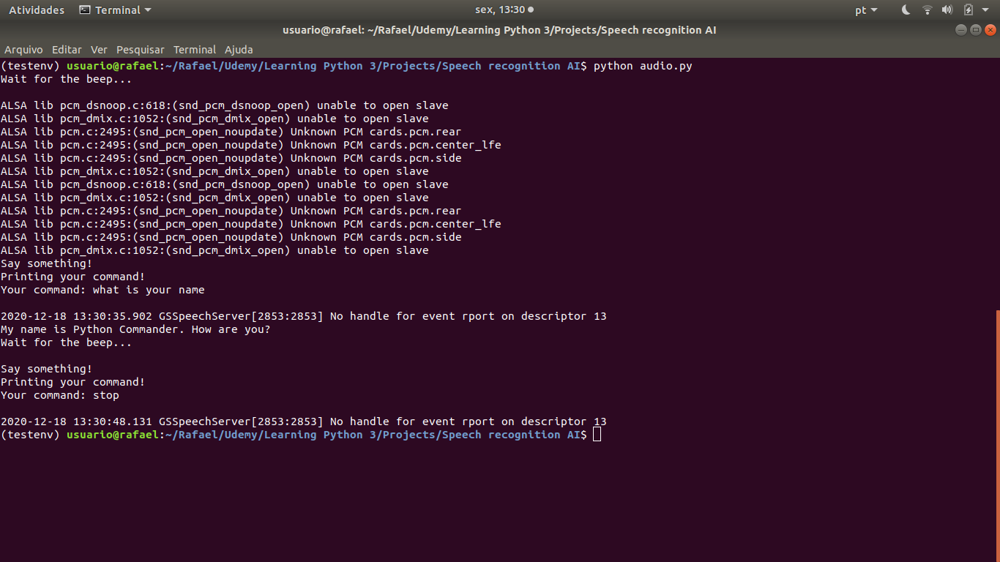

# Speech Recognition A.I.

Speech Recognition A.I. that understands, prints, repeats AND executes your voice commands!
Be sure to turn your volume on and have a microphone configured as default device for audio input, and ask for its name!

## Voice commands:
To launch an appilcation:
- launch {application name}
- open {applcation name}

To stop the A.I.:
- exit
- stop
- bye
You can hear it being grateful for talking to someone!

## Installation
Unfortunately, this module has no cross-OS services yet, so only works in Linux.

```bash
pip3 install SpeechRecognition
sudo apt-get install gnustep-gui-runtime
python audio.py
```


